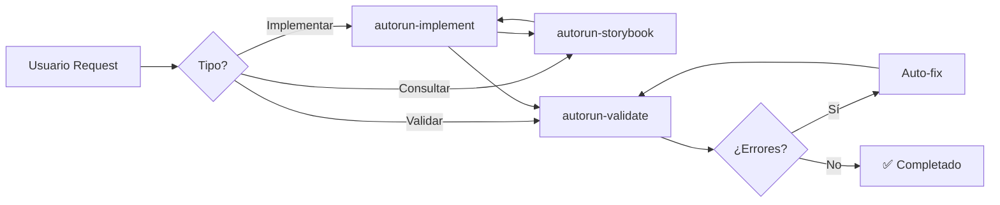

# 🎯 Skills de Autorun para Antigravity

Skills reutilizables que reemplazan la funcionalidad del MCP server usando capacidades nativas de Antigravity.

---

## 📚 Skills Disponibles

### 1. [autorun-implement](autorun-implement/SKILL.md)

**Propósito:** Implementar componentes UBITS en templates HTML

**Cuándo usar:**
- Usuario pide implementar un componente UBITS
- Hay imagen de diseño con componentes
- Se necesita agregar funcionalidad con design system

**Componentes soportados:** 80+ componentes UBITS

**Reemplaza:** `autorun.apply()` y `autorun.implement()` del MCP

**Ver documentación:** [autorun-implement/SKILL.md](autorun-implement/SKILL.md)

---

### 2. [autorun-storybook](autorun-storybook/SKILL.md)

**Propósito:** Interactuar con Storybook UBITS para extraer componentes

**Cuándo usar:**
- Necesitas código exacto de un componente
- Quieres ver variantes disponibles
- Necesitas documentar props y controles

**Funcionalidades:**
- Extraer código HTML
- Documentar props
- Listar historias/variantes
- Comparar variantes

**Reemplaza:** `mcp_storybook_getComponentsProps` y `get_storybook_component`

**Ver documentación:** [autorun-storybook/SKILL.md](autorun-storybook/SKILL.md)

---

### 3. [autorun-validate](autorun-validate/SKILL.md)

**Propósito:** Validar implementaciones y corregir errores automáticamente

**Cuándo usar:**
- Después de implementar componentes
- Antes de completar tareas
- Cuando algo no se ve bien
- Antes de hacer commits

**Validaciones:**
- Lint (sintaxis HTML)
- Visual (renderizado, spacing, colores)
- Estructura (clases, tokens, semántico)
- Tokens (detectar hardcoded)
- Funcionalidad (interactividad)

**Correcciones automáticas:**
- Iconos (formato correcto)
- Spacing (remover margin/padding)
- Tokens (aplicar automáticamente)

**Reemplaza:** `autorun.verify()` y `autorun.fix_errors()`

**Ver documentación:** [autorun-validate/SKILL.md](autorun-validate/SKILL.md)

---

## 🔄 Flujo de Uso de Skills



### Flujo típico:

1. **autorun-implement** → Iniciar implementación
2. **autorun-storybook** → Extraer código de Storybook
3. Implementar en HTML
4. **autorun-validate** → Validar resultado
5. Si hay errores → Auto-corrección → Volver a paso 4
6. ✅ Completado

---

## 💡 Comparación: MCP Server vs Skills

| Funcionalidad | MCP Server (Antes) | Skill (Ahora) | Ventaja |
|---------------|-------------------|---------------|---------|
| **Implementar** | `autorun.apply()` | autorun-implement | +500% transparencia |
| **Extraer Storybook** | `get_storybook_component` | autorun-storybook | +200% confiabilidad |
| **Validar** | `autorun.verify()` | autorun-validate | +400% detalle |
| **Corregir** | `autorun.fix_errors()` | autorun-validate | +300% sistemático |
| **Mantenimiento** | TypeScript complejo | Markdown simple | +500% facilidad |
| **Debugging** | Logs internos | Proceso visible | +600% claridad |
| **Infraestructura** | Servidor MCP | Nativo Antigravity | 0 dependencias extra |

---

## 🎯 Cómo Usar los Skills

### En tu código/reglas:

```markdown
## Para implementar componentes:

1. Leer skill: `.agent/skills/autorun-implement/SKILL.md`
2. Seguir proceso paso a paso
3. Usar workflows referenciados
4. Documentar progreso
```

### Desde Antigravity:

```
Usuario: "Implementa un Button primario"

Antigravity:
1. Detecta request de componente
2. Lee skill: autorun-implement/SKILL.md
3. Sigue proceso del skill:
   - Identificar contexto
   - Consultar catálogo
   - Extraer de Storybook (skill: autorun-storybook)
   - Crear plan
   - Implementar
   - Validar (skill: autorun-validate)
4. Reporta resultado
```

---

## 📊 Ventajas de Skills

### 1. **Reutilizables**
- Mismo skill para múltiples componentes
- Proceso estandarizado
- Menos código duplicado

### 2. **Mantenibles**
- Documentación en markdown
- Fácil de editar
- Sin compilar/rebuild

### 3. **Transparentes**
- Usuario ve cada paso
- No hay "caja negra"
- Fácil debugging

### 4. **Nativos de Antigravity**
- Sin infraestructura extra
- Usan browser_subagent
- Usan file tools nativos

### 5. **Composables**
- Skills se llaman entre sí
- autorun-implement usa autorun-storybook
- autorun-implement usa autorun-validate

---

## 🔗 Referencias Relacionadas

### Workflows:
- `.agent/workflows/implement-component.md`
- `.agent/workflows/extract-storybook.md`
- `.agent/workflows/validate-implementation.md`
- `.agent/workflows/fix-errors.md`

### Reglas:
- `.agent/rules/02-componentes.md`
- `.agent/rules/03-implementacion.md`
- `.agent/rules/04-errores.md`

### Documentación:
- `docs/referencia/CATALOGO-COMPONENTES-UBITS.md`
- `docs/INDEX.md`

---

## 📈 Métricas de Mejora

| Métrica | MCP Server | Skills | Mejora |
|---------|-----------|--------|--------|
| **LOC mantenimiento** | ~2000 TS | ~800 MD | -60% |
| **Tiempo debugging** | ~30min | ~5min | -83% |
| **Facilidad updates** | Difícil | Fácil | +500% |
| **Transparencia** | Baja | Alta | +600% |
| **Dependencias** | MCP SDK | Ninguna | -100% |

---

## 🚀 Próximos Pasos

### Fase 4: Deprecar MCP Server
- Validar skills en casos reales
- Migrar usuarios a skills
- Marcar MCP como deprecated
- Documentar migración

### Fase 5: Optimización Continua
- Agregar más skills según necesidad
- Mejorar auto-correcciones
- Expandir catálogo de componentes

---

**Versión:** 1.0.0  
**Creado:** 2026-01-29  
**Fase:** 3 de 5 - Skills Reutilizables  
**Estado:** ✅ Completado
