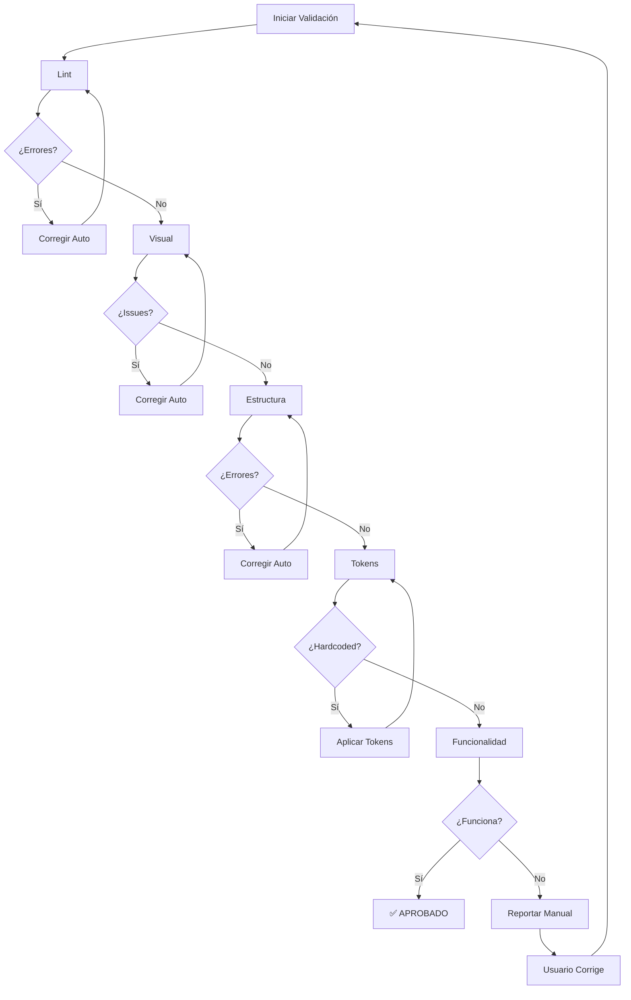

# Autorun Validate Skill

Skill especializado para validar que componentes UBITS estén correctamente implementados y corregir errores comunes automáticamente.

---

## 🎯 Cuándo Usar Este Skill

Usa este skill cuando:
- Después de implementar cualquier componente
- Antes de marcar una tarea como completada
- Cuando algo no se ve como esperado
- Usuario reporta problema visual o funcional
- Antes de hacer commit de cambios

**Palabras clave:**
- "valida", "verifica", "revisa"
- "no se ve bien", "no funciona"
- "hay errores", "lint falla"

---

## ✅ Checklist de Validación

### 1. Validación de Código (Lint)

**Ejecutar automáticamente:**
```bash
npm run lint
```

**Verificar:**
- ✅ Sin errores de sintaxis HTML
- ✅ Etiquetas correctamente cerradas
- ✅ Atributos sin duplicados
- ✅ Estructura HTML válida

**Si hay errores:**
- Documentar tipo de error
- Aplicar corrección automática (si aplica)
- Re-ejecutar lint

---

### 2. Validación Visual

**Usar browser_subagent:**
```typescript
await browser_subagent({
  TaskName: "Visual Component Validation",
  Task: `
    Navigate to http://localhost:3000/${templateFile}
    
    VERIFICAR CHECKLIST:
    
    ✅ Renderizado:
       - Componente aparece en pantalla
       - Sin errores en console
       - Estilos aplicados correctamente
    
    ✅ Spacing:
       - Usa tokens (--spacing-md, etc.)
       - NO margin/padding agregado a componentes
       - Gap en contenedor padre
    
    ✅ Colores:
       - Usa tokens (--text-primary, --surface-secondary)
       - NO valores hex hardcodeados
       - Contraste adecuado
    
    ✅ Tipografía:
       - Tamaños usan tokens (--font-size-md)
       - Font family correcto
       - Line height apropiado
    
    ✅ Iconos:
       - Aparecen correctamente
       - Tamaño apropiado
       - Formato correcto (sin fa- prefijo)
    
    ✅ Responsive (si aplica):
       - Se ve bien en desktop
       - Se adapta a mobile
       - Breakpoints  funcionan
    
    Take screenshots:
    - Normal state
    - Hover state (if interactive)
    - Mobile view
    - Console (no errors)
    
    Return validation report with evidence
  `,
  RecordingName: "validation"
});
```

---

### 3. Validación de Estructura

**Verificar elementos clave:**

```typescript
const content = await view_file({ AbsolutePath: targetFile });

// Checklist automático:
const checks = {
  hasUbitsClasses: /class="ubits-\w+"/.test(content),
  noInlineStylesExcessive: !(content.match(/style="/g) || []).length > 5,
  noMarginOnComponents: !/ubits-\w+[^>]*style.*margin/.test(content),
  noIcon Errors: !/fa-(solid|light)\s+fa-\w+/.test(content),
  usesTokens: /var\(--/.test(content),
  semanticHTML: /<(header|main|section|article|nav)/.test(content)
};
```

**Reporte:**
```markdown
### Validación de Estructura

- ${checks.hasUbitsClasses ? '✅' : '❌'} Usa clases UBITS
- ${checks.noInlineStylesExcessive ? '✅' : '❌'} Sin estilos inline excesivos
- ${checks.noMarginOnComponents ? '✅' : '❌'} Sin margin en componentes
- ${checks.noIconErrors ? '✅' : '❌'} Iconos formato correcto
- ${checks.usesTokens ? '✅' : '❌'} Usa tokens CSS
- ${checks.semanticHTML ? '✅' : '❌'} HTML semántico
```

---

### 4. Validación de Tokens

**Detectar valores hardcodeados:**

```typescript
const hardcoded = {
  colors: content.match(/#[0-9a-fA-F]{3,6}/g) || [],
  pixels: content.match(/(?<!var\([^)]*)\d+px/g) || [],
  other: content.match(/rgb\(|rgba\(/g) || []
};

if (hardcoded.colors.length > 0) {
  console.warn('⚠️ Colores hardcodeados encontrados:');
  console.warn(hardcoded.colors);
  
  // Sugerir tokens
  suggestTokens(hardcoded.colors);
}
```

**Mapa de corrección automática:**
```typescript
const tokenMap = {
  // Colores
  '#333333': 'var(--text-primary)',
  '#666666': 'var(--text-secondary)',
  '#999999': 'var(--text-tertiary)',
  '#f5f5f5': 'var(--surface-secondary)',
  '#ffffff': 'var(--surface-primary)',
  
  // Spacing
  '4px': 'var(--spacing-xs)',
  '8px': 'var(--spacing-sm)',
  '16px': 'var(--spacing-md)',
  '24px': 'var(--spacing-lg)',
  '32px': 'var(--spacing-xl)',
  
  // Font sizes
  '12px': 'var(--font-size-sm)',
  '14px': 'var(--font-size-md)',
  '16px': 'var(--font-size-lg)'
};
```

---

### 5. Validación de Funcionalidad

**Para componentes interactivos:**

```typescript
await browser_subagent({
  Task: `
    TEST CASES:
    
    1. ${componentName} functionality:
       Action: ${primaryAction}
       Expected: ${expectedBehavior}
       Verify: ${verificationMethod}
    
    2. Edge cases:
       - Empty state
       - Max data
       - Error states
       - Loading states
    
    3. Event listeners:
       - Clicks work
       - Data updates
       - State changes correctly
    
    Return: Pass/Fail for each with screenshots
  `
});
```

---

## 🔧 Corrección Automática de Errores

### Categoría 1: Iconos

**Detectar:**
```typescript
const iconErrors = content.match(/class="fa-(solid|light|regular|thin)\s+fa-\w+"/g);
```

**Corregir automáticamente:**
```typescript
if (iconErrors) {
  let corrected = content.replace(
    /(fa-(?:solid|light|regular|thin))\s+fa-(\w+)/g,
    '$1 $2'
  );
  
  await replace_file_content({
    TargetFile: targetFile,
    TargetContent: content,
    ReplacementContent: corrected,
    Instruction: "Corregir formato de iconos",
    Description: "Removido prefijo fa- de nombres de iconos",
    Complexity: 3
  });
}
```

### Categoría 2: Spacing

**Detectar:**
```typescript
const spacingErrors = content.match(/ubits-\w+[^>]*style="[^"]*(?:margin|padding)/g);
```

**Corregir:**
```typescript
// Remover margin/padding de componentes UBITS
let corrected = content.replace(
  /(class="ubits-\w+"[^>]*)\s*style="[^"]*(?:margin|padding)[^"]*"/g,
  '$1'
);

// Sugerir agregar gap al contenedor padre
console.log('💡 Sugerencia: Agregar gap al contenedor:');
console.log('<div style="display: flex; gap: var(--spacing-md)">');
```

### Categoría 3: Tokens

**Aplicar automáticamente:**
```typescript
let corrected = content;
for (const [hardcoded, token] of Object.entries(tokenMap)) {
  corrected = corrected.replaceAll(hardcoded, token);
}

if (corrected !== content) {
  await replace_file_content(...);
  console.log('✅ Tokens aplicados automáticamente');
}
```

---

## 📊 Reporte de Validación

```markdown
## ✅ Reporte de Validación: ${componentName}

**Archivo:** \`${targetFile}\`  
**Fecha:** ${new Date().toISOString()}  
**Validador:** Autorun Validate Skill

### Resultados Generales:

| Categoría | Estado | Errores | Correcciones |
|-----------|--------|---------|--------------|
| Lint | ${lintStatus} | ${lintErrors} | ${lintFixes} |
| Visual | ${visualStatus} | ${visualIssues} | ${visualFixes} |
| Estructura | ${structureStatus} | ${structureErrors} | ${structureFixes} |
| Tokens | ${tokensStatus} | ${tokenErrors} | ${tokenFixes} |
| Funcionalidad | ${funcStatus} | ${funcErrors} | ${funcFixes} |

### Detalles de Validación:

#### Lint
${lintResults}

#### Visual
${visualResults}

#### Estructura
${structureResults}

#### Tokens
${tokenResults}

#### Funcionalidad
${funcResults}

### Correcciones Aplicadas:

${corrections.map((c, i) => `${i+1}. ${c.type}: ${c.description}`).join('\n')}

### Errores que Requieren Atención Manual:

${manualFixes.length > 0 ? manualFixes.map(f => `- ${f}`).join('\n') : 'Ninguno'}

### Conclusión:

${allPassed ? '✅ Validación exitosa - Componente listo' : `❌ Requiere ${manualFixes.length} corrección(es) manual(es)`}

### Screenshots:


```

---

## 🔄 Flujo de Validación Completo



---

## 💡 Tips

### Tip 1: Validación Incremental

```typescript
// No esperar al final para validar
// Validar después de cada componente implementado

async function implementWithValidation(component) {
  await implement(component);
  const result = await validate(component);
  
  if (!result.passed) {
    await autoFix(result.errors);
    await validate(component); // Re-validar
  }
}
```

### Tip 2: Cache de Validaciones

```typescript
// Si un archivo ya pasó validación, no volver a validar
// A menos que haya cambiado

const lastValidation = cache.get(filePath);
if (lastValidation && !fileChanged(filePath, lastValidation.timestamp)) {
  return lastValidation.result;
}
```

### Tip 3: Priorizar Correcciones

```
1. **CRÍTICO:** Errores que rompen renderizado
2. **ALTO:** Errores de accesibilidad
3. **MEDIO:** Tokens hardcodeados
4. **BAJO:** Formato de código
```

---

## 🔗 Referencias

- **Workflow:** `.agent/workflows/validate-implementation.md`
- **Workflow:** `.agent/workflows/fix-errors.md`
- **Errores comunes:** `.agent/rules/04-errores.md`

---

**Versión:** 1.0.0  
**Creado:** 2026-01-29  
**Antigravity:** Compatible  
**Reemplaza:** MCP `autorun.verify()` y `autorun.fix_errors()`
