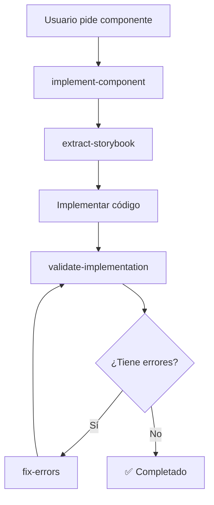

# 📚 Índice de Workflows - Autorun

Workflows que reemplazan la funcionalidad del MCP server usando capacidades nativas de Antigravity.

---

## 🎯 Workflows Core

### 1. [implement-component.md](implement-component.md)
**Propósito:** Implementar componentes UBITS desde Storybook

**Cuándo usar:**
- Usuario pide implementar un componente (Button, DataTable, etc.)
- Hay imagen de diseño con componentes UBITS
- Necesitas agregar funcionalidad con design system

**Reemplaza:** `autorun.apply()` del MCP server

---

### 2. [extract-storybook.md](extract-storybook.md)
**Propósito:** Extraer código y props desde Storybook

**Cuándo usar:**
- Necesitas código exacto de un componente
- Quieres ver todas las variantes disponibles
- Necesitas documentar props de un componente

**Reemplaza:** `get_storybook_component` y `mcp_storybook_getComponentsProps`

---

### 3. [validate-implementation.md](validate-implementation.md)
**Propósito:** Validar componentes implementados

**Cuándo usar:**
- Después de implementar cualquier componente
- Antes de marcar tarea como completada
- Cuando hay comportamiento inesperado

**Reemplaza:** `autorun.verify()` del MCP server

---

### 4. [fix-errors.md](fix-errors.md)
**Propósito:** Corregir errores comunes

**Cuándo usar:**
- Validación encontró errores
- Componente no se ve como esperado
- Lint reporta problemas

**Reemplaza:** `autorun.fix_errors()` del MCP server

---

## 🔄 Flujo Completo de Implementación



### Orden recomendado:

1. **implement-component.md** - Iniciar implementación
2. **extract-storybook.md** - Obtener código desde Storybook
3. Implementar en archivo HTML
4. **validate-implementation.md** - Validar resultado
5. **fix-errors.md** - Corregir si hay errores (repetir 4-5 hasta pasar)

---

## 💡 Comparación: MCP vs Workflows

| Funcionalidad | MCP Server (Antes) | Workflow (Ahora) | Ventaja |
|---------------|-------------------|------------------|---------|
| **Implementar componente** | `autorun.apply()` | `implement-component.md` | Más transparente |
| **Extraer de Storybook** | `get_storybook_component` | `extract-storybook.md` | Más confiable |
| **Validar** | `autorun.verify()` | `validate-implementation.md` | Más detallado |
| **Corregir errores** | `autorun.fix_errors()` | `fix-errors.md` | Más sistemático |
| **Mantenimiento** | Código TypeScript | Markdown | Más fácil |
| **Debugging** | Logs en servidor | Paso a paso visible | Más claro |

---

## 🚀 Ventajas de Workflows sobre MCP

### 1. **Transparencia Total**
- Usuario ve cada paso del proceso
- No hay "caja negra" de servidor MCP
- Fácil entender qué hace cada paso

### 2. **Más Confiable**
- Usa `browser_subagent` nativo → Ve lo que el usuario ve
- No depende de parsing de JSON que puede fallar
- Fácil ver y corregir cuando algo falla

### 3. **Fácil de Mantener**
- Workflows en markdown → Fácil editar
- MCP server en TypeScript → Requiere compilar y reiniciar
- Cambios inmediatos, sin rebuild

### 4. **Mejor Debugging**
- Cada paso documenta qué hace
- Fácil agregar prints/logs
- Ver screenshots del proceso

### 5. **No Requiere Infraestructura Extra**
- Sin servidor MCP corriendo
- Sin configuración adicional
- Todo nativo de Antigravity

---

## 📋 Cómo Usar los Workflows

### En .cursorrules o reglas:

```markdown
## Para implementar componentes:

1. Leer: `.agent/workflows/implement-component.md`
2. Seguir paso a paso
3. No saltar pasos
4. Documentar progreso
```

### En conversación con Antigravity:

```
Usuario: "Implementa un Button primario"

Antigravity: 
1. Leer workflow: .agent/workflows/implement-component.md
2. Paso 1: Identificar template → canvas-objetivos.html
3. Paso 2: Buscar en catálogo → components-button--primary
4. Paso 3: Extraer código con browser_subagent
...
```

---

## 🎯 Ejemplos de Uso

### Ejemplo 1: Implementar Button

```bash
# 1. Leer workflow
view_file .agent/workflows/implement-component.md

# 2. Seguir pasos:
# - Identificar template
# - Consultar catálogo
# - Extraer de Storybook
# - Implementar
# - Validar
```

### Ejemplo 2: Corregir Iconos

```bash
# 1. Validación detectó iconos incorrectos
# 2. Leer workflow de corrección
view_file .agent/workflows/fix-errors.md

# 3. Aplicar corrección de iconos (Categoría 2)
# 4. Re-validar
```

---

## 🔗 Referencias

- **Reglas base:** `.agent/rules/`
- **Plan completo:** Artifacts → implementation_plan.md
- **Documentación:** `docs/INDEX.md`

---

## 📊 Estado de Workflows

| Workflow | Estado | Notas |
|----------|--------|-------|
| implement-component | ✅ Creado | Funcionalen |
| extract-storybook | ✅ Creado | Funcional |
| validate-implementation | ✅ Creado | Funcional |
| fix-errors | ✅ Creado | Funcional |

**Próximos a crear (Fase 3):**
- analyze-image.md
- plan-implementation.md
- create-prototype.md

---

**Versión:** 1.0.0  
**Última actualización:** 2026-01-29  
**Fase:** 2 de 5 - Workflows de Antigravity
