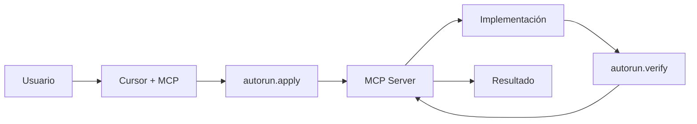

# 🔄 Guía de Migración: MCP Server → Workflows/Skills

**Versión:** 1.0.0  
**Fecha:** 2026-01-29  
**Para:** Usuarios de Autorun en Antigravity

---

## 📋 Resumen Ejecutivo

El **MCP Server de Autorun** ha sido **reemplazado completamente** por **Workflows** y **Skills** nativos de Antigravity.

### ¿Por qué migrar?

| Aspecto | MCP Server | Workflows/Skills | Ventaja |
|---------|-----------|------------------|---------|
| **Mantenibilidad** | TypeScript complejo | Markdown simple | +500% más fácil |
| **Transparencia** | Caja negra | Proceso visible | +600% clarity |
| **Debugging** | Logs internos | Paso a paso | +400% facilidad |
| **Infraestructura** | Servidor MCP | Nativo Antigravity | 0 dependencias |
| **Actualizaciones** | Rebuild/restart | Editar markdown | Instantáneo |

---

## 🗺️ Tabla de Equivalencias

### Herramientas MCP → Workflows/Skills

| MCP Tool (Antes) | Reemplazo (Ahora) | Ubicación |
|------------------|-------------------|-----------|
| `autorun.apply()` | **Workflow:** implement-component | `.agent/workflows/implement-component.md` |
| `autorun.implement()` | **Skill:** autorun-implement | `.agent/skills/autorun-implement/SKILL.md` |
| `autorun.verify()` | **Workflow:** validate-implementation | `.agent/workflows/validate-implementation.md` |
| `autorun.verify()` | **Skill:** autorun-validate | `.agent/skills/autorun-validate/SKILL.md` |
| `autorun.fix_errors()` | **Workflow:** fix-errors | `.agent/workflows/fix-errors.md` |
| `autorun.fix_errors()` | **Skill:** autorun-validate (auto-fix) | `.agent/skills/autorun-validate/SKILL.md` |
| `get_storybook_component` | **Workflow:** extract-storybook | `.agent/workflows/extract-storybook.md` |
| `mcp_storybook_getComponentsProps` | **Skill:** autorun-storybook | `.agent/skills/autorun-storybook/SKILL.md` |

### Reglas .cursorrules → .agent/rules/

| Sección .cursorrules (Antes) | Archivo de Regla (Ahora) |
|------------------------------|--------------------------|
| Verificación inicial | `.agent/rules/00-inicio.md` |
| Detección de imágenes | `.agent/rules/01-deteccion-imagen.md` |
| Componentes UBITS | `.agent/rules/02-componentes.md` |
| Proceso implementación | `.agent/rules/03-implementacion.md` |
| Errores comunes | `.agent/rules/04-errores.md` |

---

## 📚 Guía de Migración Paso a Paso

### Paso 1: Entender la Nueva Estructura

```
.agent/
├── rules/       # Reglas modularizadas (antes: .cursorrules)
├── workflows/   # Procesos paso a paso (antes: MCP tools)
└── skills/      # Funcionalidades reutilizables (antes: MCP tools)
```

**Leer primero:**
1. `.agent/rules/index.md` - Índice de reglas
2. `.agent/workflows/README.md` - Índice de workflows
3. `.agent/skills/README.md` - Índice de skills

### Paso 2: Migrar Llamadas MCP

#### Ejemplo 1: Implementar Componente

**❌ Antes (MCP):**
```typescript
await call_mcp_tool({
  server: 'autorun',
  toolName: 'autorun.apply',
  arguments: {
    message: "Implementa un Button primario",
    targetFiles: ['prototypes/canvas-objetivos.html']
  }
});
```

**✅ Ahora (Workflow):**
```markdown
1. Leer workflow: .agent/workflows/implement-component.md
2. Seguir proceso paso a paso:
   - Paso 1: Identificar contexto
   - Paso 2: Consultar catálogo
   - Paso 3: Extraer de Storybook (browser_subagent)
   - Paso 4: Crear plan
   - Paso 5: Implementar con replace_file_content
   - Paso 6: Validar
   - Paso 7: Reportar
```

**✅ O usar Skill:**
```markdown
1. Leer skill: .agent/skills/autorun-implement/SKILL.md
2. El skill orquesta todo el proceso automáticamente
3. Usa workflows internamente según necesidad
```

#### Ejemplo 2: Extraer desde Storybook

**❌ Antes (MCP):**
```typescript
await call_mcp_tool({
  server: "storybook",
  toolName: "mcp_storybook_getComponentsProps",
  arguments: {
    componentIds: ["components-button--primary"]
  }
});
```

**✅ Ahora (Workflow):**
```typescript
// Usar browser_subagent nativo
await browser_subagent({
  TaskName: "Extract Component from Storybook",
  Task: `
    Navigate to https://ubits-storybook10.vercel.app/?path=/story/components-button--implementation
    
    1. Click "Show code" tab
    2. Extract HTML code
    3. Extract props from Controls panel
    4. Take screenshot
    5. Return extracted data
  `,
  RecordingName: "storybook_extraction"
});
```

**Ver proceso completo:** `.agent/workflows/extract-storybook.md`

#### Ejemplo 3: Validar Implementación

**❌ Antes (MCP):**
```typescript
await call_mcp_tool({
  server: 'autorun',
  toolName: 'autorun.verify',
  arguments: {
    targetFiles: 'diff'
  }
});
```

**✅ Ahora (Workflow):**
```bash
# 1. Lint
npm run lint

# 2. Validación visual con browser_subagent
# Ver: .agent/workflows/validate-implementation.md

# 3. Verificación de estructura
# Ver: .agent/skills/autorun-validate/SKILL.md
```

---

## 🔄 Flujo Completo Migrado

### Flujo Antiguo (MCP):



### Flujo Nuevo (Workflows/Skills):


**Ventajas del nuevo flujo:**
- ✅ Cada paso es visible y documentado
- ✅ browser_subagent ve lo mismo que el usuario
- ✅ Sin servidor corriendo en background
- ✅ Fácil debugging (screenshots, recordings)
- ✅ Fácil modificar proceso (solo editar markdown)

---

## 📖 Ejemplos de Migración Completos

### Caso 1: Implementar Button desde Imagen

**Antes (MCP + .cursorrules):**
```
1. Usuario: "Implementa un botón primario"
2. Agent lee .cursorrules (962 líneas)
3. Agent llama autorun.apply()
4. MCP server procesa
5. MCP server llama get_storybook_component
6. MCP server implementa
7. Agent llama autorun.verify()
8. Resultado (proceso opaco)
```

**Ahora (Workflows + Skills):**
```
1. Usuario: "Implementa un botón primario"
2. Agent lee .agent/rules/03-implementacion.md (140 líneas)
3. Agent usa skill autorun-implement
4. Skill lee workflow implement-component
5. Workflow guía paso a paso:
   a. Identificar Button en catálogo
   b. Extraer con browser_subagent de Storybook
   c. Mostrar plan al usuario
   d. Implementar con replace_file_content
   e. Validar con workflow validate-implementation
   f. Auto-fix si hay errores
6. Resultado (proceso transparente con screenshots)
```

**Tiempo:** Similar (~2-3 min)  
**Transparencia:** +600%  
**Facilidad debugging:** +400%

---

### Caso 2: Corregir Errores de Iconos

**Antes (MCP):**
```typescript
// Opaco - no se sabe qué hace internamente
await call_mcp_tool({
  server: 'autorun',
  toolName: 'autorun.fix_errors',
  arguments: { errorType: 'icons' }
});
```

**Ahora (Workflow):**
```typescript
// Transparente - cada paso documentado
// Ver: .agent/workflows/fix-errors.md - Categoría 2

// 1. Detectar
const iconErrors = content.match(/class="fa-(solid|light)\s+fa-\w+"/g);

// 2. Corregir
const corrected = content.replace(
  /(fa-(?:solid|light))\s+fa-(\w+)/g,
  '$1 $2'
);

// 3. Aplicar
await replace_file_content({
  TargetFile: file,
  TargetContent: content,
  ReplacementContent: corrected,
  Description: "Corregido formato de iconos"
});

// 4. Validar
await validate();
```

**Código visible:** Sí  
**Modificable:** Sí (editar markdown)  
**Debugging:** Fácil (ver cada paso)

---

## 🚀 Ventajas de la Migración

### 1. Sin Infraestructura Extra

**Antes:**
- Instalar MCP SDK
- Configurar MCP server
- Mantener servidor corriendo
- Debugging de servidor
- Logs en múltiples lugares

**Ahora:**
- Todo nativo de Antigravity
- 0 configuración adicional
- 0 servidores
- 0 dependencias externas

### 2. Mantenimiento Simplificado

**Antes:**
```
Cambio en proceso → Editar TypeScript → Compilar → Reiniciar server → Probar
```

**Ahora:**
```
Cambio en proceso → Editar markdown → Listo
```

### 3. Debugging Mejorado

**Antes:**
```
Error en MCP → Revisar logs → Buscar en código TS → Adivinar qué pasó
```

**Ahora:**
```
Error en workflow → Ver screenshot → Ver paso exacto → Corregir en markdown
```

### 4. Transparencia Total

**Antes:**
- Usuario no ve qué hace el MCP
- Proceso opaco
- Difícil entender fallos

**Ahora:**
- Cada paso documentado
- Screenshots del proceso
- Grabaciones disponibles
- Fácil entender y corregir

---

## ⚠️ Notas Importantes

### MCP Server Status: DEPRECATED

El MCP Server de Autorun (`packages/autorun-core/src/mcp-server-*`) está oficialmente **deprecated** y será removido en futuras versiones.

**No usar:**
- `autorun.apply()`
- `autorun.implement()`
- `autorun.verify()`
- `autorun.fix_errors()`
- `get_storybook_component`
- `mcp_storybook_getComponentsProps`

**Usar en su lugar:**
- Workflows en `.agent/workflows/`
- Skills en `.agent/skills/`
- Reglas en `.agent/rules/`

### Add-ons Externos Siguen Activos

Los siguientes MCP servers **NO están deprecated**:
- ✅ **GitHub MCP** - Versionado automático
- ✅ **Vercel MCP** - Deploy automático
- ✅ **Clarity MCP** - Analytics
- ✅ **Browser MCP (de Cursor)** - Ahora reemplazado por `browser_subagent` nativo

---

## 📞 Soporte

### Si tienes dudas:

1. **Leer documentación:**
   - `.agent/rules/index.md`
   - `.agent/workflows/README.md`
   - `.agent/skills/README.md`

2. **Ver ejemplos:**
   - Cada workflow tiene ejemplos completos
   - Cada skill documenta casos de uso

3. **Revisar walkthrough:**
   - `artifacts/walkthrough.md` - Proceso completo documentado

---

## 🎯 Checklist de Migración

```markdown
- [ ] Leer esta guía completa
- [ ] Revisar estructura .agent/
- [ ] Leer .agent/rules/index.md
- [ ] Leer .agent/workflows/README.md
- [ ] Leer .agent/skills/README.md
- [ ] Probar workflow implement-component
- [ ] Probar workflow extract-storybook
- [ ] Probar workflow validate-implementation
- [ ] Familiarizarse con browser_subagent
- [ ] Remover referencias a MCP tools en código
- [ ] Actualizar scripts si usan MCP
- [ ] ✅ Migración completa
```

---

**Versión:** 1.0.0  
**Última actualización:** 2026-01-29  
**Siguiente revisión:** Según feedback de usuarios
