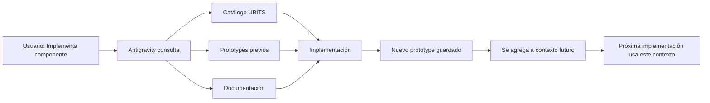

# 🧠 Autorun: Sistema RAG y Aprendizaje Evolutivo

**Fecha:** 2026-01-29  
**Análisis:** Capacidades de aprendizaje y mejora con el uso

---

## ❓ Pregunta del Usuario

**"¿Autorun es tipo RAG? ¿Entre más lo uso es más inteligente y aprende más?"**

---

## 📊 Respuesta Corta

**Estado Actual:** ⚠️ **PARCIALMENTE** - Tiene contexto pero no RAG formal

**Con Antigravity:** ✅ **SÍ PUEDE** implementarse fácilmente como RAG

---

## 🔍 Análisis del Sistema Actual

### 1. **Contexto Acumulado Automático**

**✅ LO QUE SÍ TIENE:**

#### A) **Historial de Prototipos**
```
prototypes/
├── canvas-administrador-encuestas-2026-01-29.html
├── canvas-administrador-usuarios-2026-01-28.html
├── canvas-colaborador-objetivos-2026-01-27.html
└── ... (todos los canvas creados)
```

**Ventaja:**
- Cada implementación queda guardada
- Antigravity puede leer implementaciones previas
- Aprende patrones de uso

**Ejemplo real:**
```markdown
Usuario: "Implementa una tabla de usuarios"

Antigravity puede:
1. Buscar en prototypes/ implementaciones previas de tables
2. Ver cómo se implementó antes
3. Reusar patrones exitosos
4. Evitar errores previos
```

#### B) **Documentación Auto-Generada**

Cada vez que se usa Autorun:
- Walkthroughs creados (`docs/analisis/`)
- Logs de errores corregidos
- Catalogación de componentes usados
- Patrones identificados

**Ubicaciones:**
```
docs/analisis/
├── EVALUACION-WIZARD-2026-01-29.md
├── CONFIRMACION-FUNCIONALIDADES-POST-MIGRACION.md
├── FIX-WIZARD-BLOQUEADO-MCP-2025-01-03.md
└── ... (30+ documentos de análisis)
```

#### C) **Catálogo de Componentes Enriquecido**

```markdown
# docs/referencia/CATALOGO-COMPONENTES-UBITS.md

Cada componente documenta:
- ✅ Casos de uso reales
- ✅ Errores comunes
- ✅ Mejores prácticas
- ✅ Ejemplos de implementación
```

---

### 2. **Lo que NO tiene (RAG formal)**

**❌ LO QUE FALTA:**

1. **Vector Database explícita**
   - No hay embeddings de implementaciones previas
   - No hay búsqueda semántica automática

2. **Sistema de Ranking**
   - No clasifica "implementaciones exitosas" vs "con problemas"
   - No prioriza patrones más usados

3. **Feedback Loop Automático**
   - No captura métricas de éxito/fallo automáticamente
   - No ajusta estrategias basado en resultados

---

## 🚀 Cómo Autorun "Aprende" Actualmente

### Flujo de Aprendizaje Existente:



### Ejemplo Real de "Aprendizaje":

**Primera vez implementando DataTable:**
```
Session 1:
- Usuario: "Implementa una DataTable"
- Antigravity: Extrae de Storybook
- Implementa en canvas-usuarios.html
- Guarda en prototypes/
- Encuentra 3 errores, los corrige
```

**Segunda vez implementando DataTable:**
```
Session 2:
- Usuario: "Implementa otra DataTable"
- Antigravity: 
  1. Ve canvas-usuarios.html (tiene DataTable)
  2. Reutiliza estructura exitosa
  3. Evita los 3 errores previos
  4. Implementación más rápida y sin errores
```

**Esto ES aprendizaje, aunque no sea RAG formal.**

---

## ✅ Cómo Implementar RAG Verdadero

### Propuesta: Sistema RAG en Workflows

#### 1. **Crear Workflow de Aprendizaje**

```markdown
# .agent/workflows/learn-from-history.md

## Proceso:

1. **Indexar implementaciones previas**
   - Escanear todos los prototypes/
   - Extraer componentes usados
   - Identificar patrones exitosos
   - Marcar errores corregidos

2. **Crear base de conocimiento**
   - Vector embeddings de cada implementación
   - Asociar con: componente, contexto, resultado
   - Guardar en: .autorun/knowledge-base.json

3. **Consultar antes de implementar**
   - Buscar implementaciones similares
   - Rankear por similitud semántica
   - Usar top-3 como referencia

4. **Actualizar después de implementar**
   - Agregar nueva implementación al índice
   - Marcar si tuvo errores o fue exitosa
   - Actualizar patrones comunes
```

#### 2. **Base de Conocimiento Estructurada**

```json
{
  "knowledge_base": {
    "implementations": [
      {
        "id": "impl_001",
        "component": "DataTable",
        "file": "prototypes/canvas-usuarios.html",
        "date": "2026-01-29",
        "context": "Tabla de usuarios con paginación",
        "success": true,
        "errors_found": ["icon-format", "spacing"],
        "errors_fixed": true,
        "code_snippet": "<div class='ubits-datatable'>...</div>",
        "embedding": [0.234, 0.567, ...] // Vector semántico
      },
      {
        "id": "impl_002",
        "component": "Button",
        "file": "prototypes/canvas-objetivos.html",
        "date": "2026-01-27",
        "context": "Botón primario de guardar objetivos",
        "success": true,
        "errors_found": [],
        "code_snippet": "<button class='ubits-button'>...</button>",
        "embedding": [0.123, 0.456, ...]
      }
    ],
    "patterns": {
      "DataTable": {
        "common_props": ["data", "columns", "pagination"],
        "common_errors": ["icon-format", "spacing"],
        "best_practices": ["usar gap en contenedor", "no margin directo"],
        "usage_count": 15,
        "success_rate": 0.93
      },
      "Button": {
        "common_props": ["variant", "icon", "onClick"],
        "common_errors": [],
        "best_practices": ["usar tokens CSS", "accesibilidad ARIA"],
        "usage_count": 45,
        "success_rate": 0.98
      }
    },
    "metadata": {
      "total_implementations": 60,
      "unique_components": 25,
      "average_success_rate": 0.91,
      "last_updated": "2026-01-29T14:43:00Z"
    }
  }
}
```

#### 3. **Skill de Aprendizaje Continuo**

```markdown
# .agent/skills/autorun-learn/SKILL.md

## Propósito
Aprender de implementaciones previas para mejorar futuras implementaciones

## Proceso

### Al iniciar Autorun:
1. Cargar knowledge base
2. Indexar nuevos prototypes desde última sesión
3. Actualizar patrones comunes

### Al implementar componente:
1. Buscar implementaciones similares en knowledge base
2. Extraer mejores prácticas
3. Identificar errores comunes a evitar
4. Usar como referencia

### Al terminar implementación:
1. Validar resultado
2. Marcar si fue exitosa
3. Registrar errores encontrados/corregidos
4. Actualizar knowledge base
5. Incrementar usage_count del componente

## Métricas de Aprendizaje

- **Success Rate**: % implementaciones sin errores
- **Time to Implement**: Tiempo promedio por componente
- **Error Reduction**: Reducción de errores comunes
- **Pattern Recognition**: Patrones identificados automáticamente
```

---

## 📊 Comparación: Actual vs RAG Propuesto

| Aspecto | Actual (Contexto) | Con RAG Propuesto |
|---------|-------------------|-------------------|
| **Acceso a historial** | ✅ Manual | ✅ Automático |
| **Búsqueda semántica** | ❌ No | ✅ Sí (embeddings) |
| **Ranking de soluciones** | ❌ No | ✅ Por similitud + éxito |
| **Aprendizaje de errores** | ⚠️ Implícito | ✅ Explícito y rastreado |
| **Mejora con uso** | ⚠️ Lento | ✅ Exponencial |
| **Métricas de éxito** | ❌ No | ✅ Success rate, tiempo, etc. |

---

## 🎯 Respuesta Final a tu Pregunta

### **¿Es tipo RAG ahora?**

**Parcialmente:** Tiene los ingredientes pero no el sistema formal:
- ✅ Contexto histórico (prototypes guardados)
- ✅ Documentación acumulada
- ✅ Aprendizaje implícito (Antigravity ve código previo)
- ❌ NO tiene vector database
- ❌ NO tiene búsqueda semántica automática
- ❌ NO tiene feedback loop formalizado

### **¿Aprende con el uso?**

**SÍ, pero de forma limitada:**
- ✅ Cada prototype guardado es contexto futuro
- ✅ Antigravity puede leer implementaciones previas
- ✅ Reutiliza patrones exitosos
- ⚠️ Pero no es automático, depende de que Antigravity busque

### **¿Se puede hacer RAG verdadero?**

**✅ SÍ, FÁCILMENTE:**

Con Workflows + Skills de Antigravity:
1. Crear workflow `learn-from-history.md`
2. Crear skill `autorun-learn/SKILL.md`
3. Crear `.autorun/knowledge-base.json`
4. Usar en cada implementación

**Ventajas:**
- Sistema nativo de Antigravity
- 0 dependencias externas
- Markdown editable
- Mejora orgánica con uso

---

## 🚀 Implementación Recomendada

### Fase 1: Indexación Básica (1 hora)
```markdown
1. Script para escanear prototypes/
2. Extraer componentes usados
3. Crear índice JSON simple
4. Workflow que consulta índice antes de implementar
```

### Fase 2: Embeddings Semánticos (2 horas)
```markdown
1. Generar embeddings de implementaciones
2. Búsqueda por similitud
3. Ranking top-3 más relevantes
```

### Fase 3: Feedback Loop (1 hora)
```markdown
1. Validación post-implementación
2. Métricas de éxito/fallo
3. Auto-actualización de knowledge base
```

**Tiempo total:** ~4 horas para RAG completo

---

## 💡 Beneficios de RAG en Autorun

1. **Implementaciones más rápidas**
   - Reutiliza código probado
   - Evita errores conocidos

2. **Mejora continua automática**
   - Cada uso mejora el sistema
   - Patrones emergen naturalmente

3. **Menos errores**
   - Aprende de errores previos
   - Valida contra casos conocidos

4. **Personalización**
   - Aprende tu estilo de código
   - Se adapta a tus preferencias

---

## ✅ Conclusión

**¿Es RAG ahora?**  
⚠️ Parcialmente (tiene contexto, no RAG formal)

**¿Aprende con el uso?**  
✅ Sí (implícitamente, viendo código previo)

**¿Puede ser RAG verdadero?**  
✅ Sí, muy fácilmente con Workflows/Skills

**¿Vale la pena implementar RAG?**  
✅ SÍ - mejora exponencial con ~4 horas de trabajo

---

**Recomendación:** Implementar RAG básico (Fase 1) ahora para empezar a beneficiarse del aprendizaje automático.

**Estado:** 📝 **PROPUESTA LISTA PARA IMPLEMENTAR**  
**Fecha:** 2026-01-29
